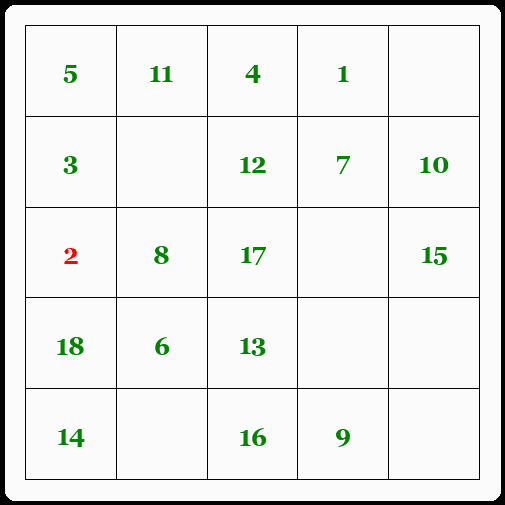

# Puzzle Multi-Agents

> Made by **DELAGES Julien** and **ROUX Dorian** during the Module of **Opening** from the Engineer Path of CY TECH, France. 

<br>

It is a multi-agents project based on the [Puzzle Game](https://en.wikipedia.org/wiki/15_puzzle). We realized the project using [Python](https://www.python.org/) and [Streamlit](https://streamlit.io/). The project is deployed through [Docker](https://www.docker.com/).
 We describe the project through the following sections.
- [I. Project Demonstration](#project-demonstration)
- [II. Repository Structure](#repository-structure)
- [III. Project Description](#project-description)
- [IV. Project Deployment](#project-deployment)
    - [Online Deployment](#online-deployment)
    - [Local Deployment](#local-deployment)


<br>

## I. Project Demonstration


<br>

## II. Repository Structure
The structure of this repository is described below. It contains the source code of the project as well as the Dockerfile used to build the Docker Image.

```bash
├── app.py  
├── Dockerfile  
├── requirements.txt    
└── src    
    ├─ agents.py  
    ├── color_print.py  
    ├── draw_grid.py  
    ├── message.py  
    ├── static    
    │   ├── fonts     
    │   │   └── georgia bold.ttf   
    │   └── images  
    │       └── iconCYTECH.png  
    └── utils.py
```


## III. Project Description

### Introduction

### Agents and Communication

### Board

To generate the **board**, we need to define the board size (number of rows, *R* and columns, *C*) and the number of **agents** to initialize. Note that, there cannot be more than $(R \times C - 1)$ agents since it is required to have at least one empty tile.

The agents are randomly placed on the board. The board is then shuffled by applying a random sequence of moves to the agents. This process ensures the randomness of the puzzle but also its faisability.

<br>

### Graphical Interface

To better visualize the Board, we decided to create a graphical interface. It is based on the [Streamlit](https://streamlit.io/) library. It is composed of three different phases.

The first phase is the **configuration** where a User can define the board (number of rows, number of columns and filling percentage) and the system processing parameters (max execution time and the display frequency).

The second phase is the **launching and processing** where the board is generated based on the configuration, the Agents are placed randomly and the board is getting solved. In this phase, the User can see the evolution of the board compared with the initial board.

The last phase is the **results** where the User can compare two differents puzzle states with the initial and final being as default. Note that, each state is not based on *step* but the display frequency defined in the configuration.

<br>

### Conclusion

The puzzle we developed is not perfect and can be improved in some ways. A great addition to this project would be to implement different algorithm to make the agents communicates and move (other than **A***).

Also, we didnt not fixed every existing patterns that would make the puzzle impossible to solve. For instance, we sometime face the following issue where an agent is pushing another agent to reach a position and then, the agent is pushed back by the other agent trying to re-reach his final position.  
<p align="center">
    <a href="https://dorian-roux-puzzle-multi-agents-app-oec2z6.streamlit.app">
        
    </a>
</p>

Finally, the interface is not the most suitable for this project but it was the most convenient to propose a visible interface within a short amount of time. Thus, there exists some **bugs** because of Streamlit that we were not able to handle but that may be fixed.

<br>


## IV. Project Deployment

### Online Deployment

The interface is hosted through Streamlit. It is available at the following [Link](https://dorian-roux-puzzle-multi-agents-app-oec2z6.streamlit.app/).

Due to the lack of time, we could not make the most suitable interface regarding the project, however, we tried to make it as user-friendly as possible while being able to display answers to the multi-agents problematic.

<br>

### Local Deployment

The local deployment is based on Docker. Thus, to correctly launch our interface, the [Docker](https://www.docker.com/) software must be installed. The deployment is relatively easy since it consists of the three steps described below.

#### **1° - Clone the Repository**
Firstly, you must clone this reposity. To do so, you can use the following command.
```bash
git clone https://github.com/dorian-roux/ing3-ouverture-ia
```

#### **2° - Build the Docker Image**
Secondly, you need to build the Docker Image based on this repository Dockerfile. To do so, you can use the following command.
```bash
docker build -t {TAG} .
```
<u>Note:</u> &nbsp; `{TAG}` is the name you want to give to your Docker Image. It is used to identify it later.


#### **3° - Run the Docker Container**
Finally, you need to run the Docker Container based on the Docker Image you just built. To do so, you can use the following command.
```bash
docker run -p 8501:8501 {TAG}
```
<u>Note:</u> &nbsp; We defined the port `8501` as the port used by the Streamlit Interface. Thus, you can access it by typing `localhost:8501` in your browser.


